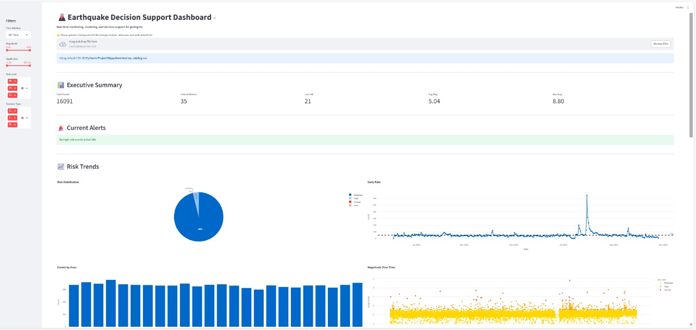

# 🌋 Earthquake Decision Support Dashboard

[](https://earthquake-dashboard-cgvhfezrzxbdrbxzjwxhnw.streamlit.app/)

An interactive and analytical dashboard built with **Streamlit**, **Plotly**, and **Pandas** — designed to help geologists, researchers, and decision-makers monitor, visualize, and analyze earthquake activity in real-time.  

This project provides insights into **risk levels, tectonic behavior, aftershock clustering, and event trends**, offering a decision-support framework for emergency preparedness and geological studies.It is part of the Data Science and MLOps course task from Bongodev, designed to help newcomers develop analytical thinking and visualization skills.


---
## 🛠 Features

### Real-time Earthquake Monitoring
- View and filter recent events by date, magnitude, and depth.
- Detect active aftershock clusters within 24 hours.  

### Executive Summary
- Total events
- Critical events (M ≥ 6.5)
- Recent 24-hour events
- Average and maximum magnitudes

### Current Alerts
- Highlights high-risk events in the last 24 hours.
- Shows magnitude, location, and time since occurrence.

### Visual Analytics
- **Risk Trends**: Pie chart for risk levels, bar chart by hour, line chart for daily events.
- **Magnitude Over Time**: Scatter plot colored by risk level.
- **Risk Map**: Interactive map showing event locations and magnitudes.

### Aftershock Clusters
- Detects clusters within 24 hours of previous events.
- Interactive cluster map and summary table.

### Decision Support
- Provides recommendations based on recent events, critical magnitudes, and active clusters.
- Displays priority metrics for emergency planning.

### Data Export
- View filtered dataset in a table.
- Download filtered data as CSV.

---

## 📁 Project Structure

```
📦 earthquake-decision-support-dashboard
 ┣ 📄 earthquake-decision-support-dashboard.py   # Main Streamlit app
 ┣ 📄 eq_catalog.csv                             # Default dataset (can be replaced)
 ┣ 📄 requirements.txt                           # Project dependencies
 ┗ 📄 README.md                                  # Project documentation
```

---

## ⚙️ Installation & Usage

### 🔹 1. Clone the repository
```bash
git clone https://github.com/<your-username>/earthquake-decision-support-dashboard.git
cd earthquake-decision-support-dashboard
```

### 🔹 2. Install dependencies
```bash
pip install -r requirements.txt
```

### 🔹 3. Run the dashboard
```bash
streamlit run earthquake-decision-support-dashboard.py
```

> 💡 If no file is uploaded, the app automatically loads the default dataset (`eq_catalog.csv`).

---

## 🧮 Tech Stack

| Category | Technology |
|-----------|-------------|
| **Frontend / UI** | Streamlit |
| **Visualization** | Plotly Express |
| **Data Processing** | Pandas, NumPy |
| **Styling & Layout** | Streamlit Layout API |
| **Export Tools** | CSV Download, ReportLab (PDF-ready) |

---

## 🧠 Insights Provided

- **Risk Level Distribution** — event severity classification  
- **Temporal Trends** — daily, hourly, and magnitude-based activity  
- **Spatial Analysis** — interactive map visualizing seismic zones  
- **Cluster Detection** — aftershock identification within 24 hours  
- **Decision Support Summary** — recommended response actions  

---

## 🌐 Demo Dataset
A sample dataset (`eq_catalog.csv`) is provided to explore dashboard functionality.  
You can upload your own CSV file containing:
```
time, place, latitude, longitude, depth, magnitude
```

---

## 🚀 Future Enhancements
- Integration with live USGS Earthquake API for real-time updates  
- Predictive modeling for aftershock probability  
- 3D visualizations of seismic depth vs. magnitude  
- Multi-language support (English / Bangla)  
- Auto-generated PDF summary reports  

---

## 🧭 Author & Credits

**Mentor:** *Masum Bhuiyan*
**Developed by:** *Mohammad Abdul Kader*  
**Category:** Data Science | Earthquake Analytics | Visualization  
**Tools:** Python, Streamlit, Plotly, Pandas, NumPy  

> 🌍 This dashboard aims to help researchers, analysts, and emergency teams make informed, data-driven decisions in seismic risk management.

---

## 📸 Preview (Example)
> 
---

## 💾 License
This project is open-source under the **MIT License** — feel free to use and modify it for educational or research purposes.

---
